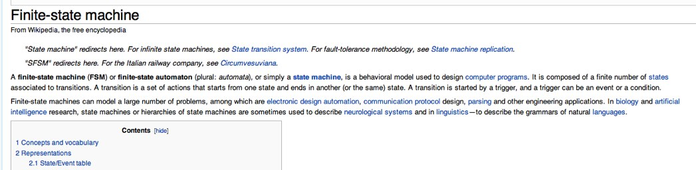
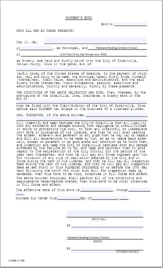

!SLIDE 
# State Machine

## https://github.com/pluginaweek/state_machine

!SLIDE 
# Why did we use state_machine? #

!SLIDE center

# Maybe? #

!SLIDE 

# Real Reasons #

* Provides a CHEAP "mini-DSL" for your domain logic
* Replace messy/inconsistent boolean methods throughout the class
* Provided everything we needed in a small footprint
* Enforces consistency across the many objects implementing state logic

!SLIDE 
# An example application

## Students!

!SLIDE center
# state_machine at Merchants Bonding

!SLIDE 

# Updating/Endorsing surety bonds

* Legal documents that express an obligation over time
* Changes need to be made to the obligation (needing to endorse the
  legal document)
* Lots of different "categories" of changes
* Web users request changes
* Merchants' employee approves changes

!SLIDE 

# Common workflow for all updates

* User submits request to update surety bond => 
* Employee approves/declines update request => 
* User executes update and gets endorsement documentation (records
  updated, optionally billing created)

!SLIDE 
# Events 

* Submit/Remove for Review
* Approve/Decline for Execution
* Execute
* Cancel

!SLIDE smaller
# Defining a state machine for a generic update

    @@@ ruby
    class Update

      state_machine :state, :initial => :draft do

        event :submit_for_review do
          transition [:draft, 
                      :editing_renewal] => :pending_review
        end

        ....

        event :execute do
          transition [:draft, 
                      :pending_review, 
                      :pending_activation] => :executed
        end

      end
    end

!SLIDE smaller 

# Specifying validations for a particular type of update

    @@@ ruby
    class NameUpdate < Update

      validates :name, :presence => true
      validates :surety_bond, :presence => true
      validate :name_attributes_must_be_changed, :if => :draft?

      ....

      def principal_name_attributes_must_be_changed
        unless principal_name_attributes_changed?
          errors[:base] << "No principal name values were changed"
        end
      end

    end

!SLIDE smaller 

# Specifying callbacks for update type

    @@@ ruby
    class NameUpdate < Update
      
      ....

      state_machine do
        after_transition :on => :submit_for_review, 
                         :do => :deliver_pending_review_notifications
        ....
        before_transition :on => :execute, :do => :update_surety_bond
      end

      def update_surety_bond
        ....
      end

      def deliver_pending_review_notifications
        SuretyBondMailer.delay(:priority => 50).update_request_notification(self)
      end

    end

!SLIDE smaller 
# Mapping the events to controller actions

    @@@ ruby
    class UpdatesController < ApplicationController

      ....

      def submit_for_review
        update.submit_for_review
        flash[:success] = after_submit_for_review_flash_message
        redirect_to :action => :show
      end

      def execute
        update.execute
        flash[:success] = after_execute_flash_message
        redirect_to after_execute_path
      end

      ....

    end

!SLIDE smaller 
# Using declarative_authorization gem to control access to events

    @@@ ruby
    authorization do

      role :commercial do
      
        ....

        has_permission_on :surety_bond_principal_address_updates, 
                          :to => [:manage, :execute]
        has_permission_on :surety_bond_principal_name_updates, 
                          :to => [:manage, :execute, 
                                  :approve_for_execution, :decline_for_execution,
                                  :cancel, :toggle_notification]
        
        ....

        end
      end
    end

!SLIDE 
# No More

* Questions
* Discussion

!SLIDE 
# Resources

* state_machine gem [https://github.com/pluginaweek/state_machine](https://github.com/pluginaweek/state_machine)
* declarative_authorization gem [https://github.com/stffn/declarative_authorization](https://github.com/stffn/declarative_authorization)
* simple_form gem [https://github.com/plataformatec/simple_form](https://github.com/plataformatec/simple_form)
